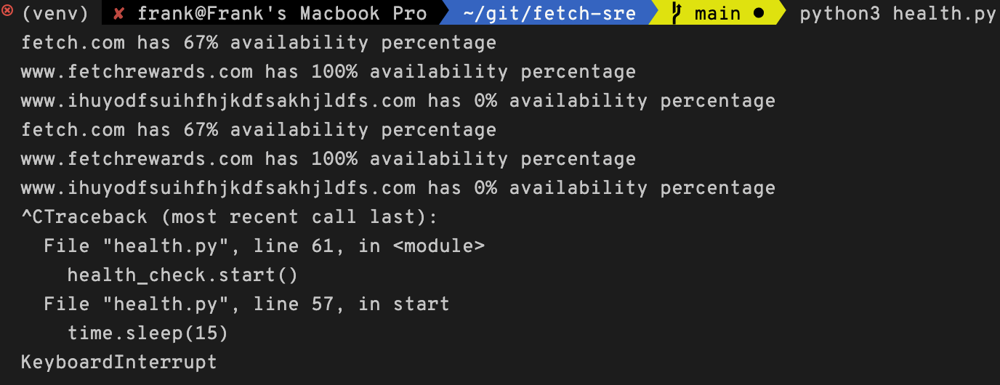

# Fetch

### Setting up environment
Software requirement: 
- Linux/macOS
- Python3(I use 3.10, but it should work on all 3.7+ versions)

Create `config.yaml` and put the config in YAML format.

### Running the program:

1. Run `pip install -r requirements.txt`
2. Run `python3 health.py`

If it doesn't work for you, you can run it using Docker:
1. `docker build -t healthcheck .`
2. `docker run -t -v $PWD/config.yaml:/app/config.yaml healthcheck`

### Screenshot

